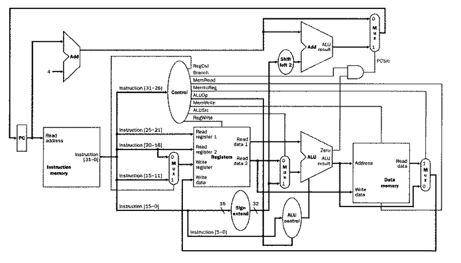

## RISC-V Processor

This repository contains the source code for a toy RISC-V processor. The processor is implemented in SystemVerilog and is designed to be a simple, educational tool for learning about the RISC-V instruction set architecture.

## Directory Structure

The main components of the processor are organized as follows:

- `RegFile.sv`: Register file module.
- `ALU.sv`: Arithmetic Logic Unit module.
- `ALUControl.sv`: ALU Control module.
- `Control.sv`: Main control unit module.
- `ImmGen.sv`: Immediate Generator module.
- `InstMem.sv`: Instruction Memory module.
- `Memory.sv`: Data Memory module.
- `PC.sv`: Program Counter module.
- `Processor.sv`: Top-level Processor module.
- `input.txt`: Input file containing the binary representation of the instructions.